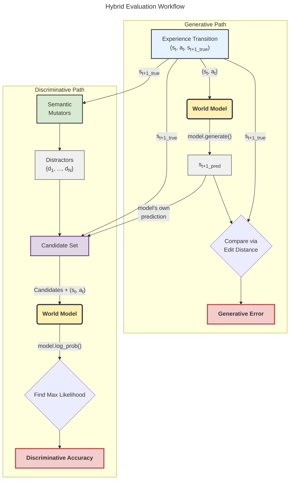

# PRD: Hybrid Evaluation Framework for Symbolic World Models

## 1. Overview

This document specifies the design for a hybrid evaluation framework for symbolic world models. Our project (12-distant-sunburn) aims to synthesize probabilistic, programmatic world models from environment interaction. The target environments, such as Crafter, feature complex symbolic states, partial observability, and significant stochasticity.

This framework is designed to provide a robust, quantitative measure of a world model's quality. It must assess both the model's ability to generate plausible future states and its fine-grained understanding of the environment's transition dynamics, including stochastic elements.

## 2. The Core Problem: Limitations of Naive Evaluation

Simple evaluation metrics fail to capture the necessary qualities of a good world model in our target environments.

*   **Deterministic Metrics are Insufficient:** Metrics like structured edit distance (e.g., JSON Patch distance) are overly punitive for stochastic events. A model that predicts a zombie will move north has the same edit distance as a model that predicts it will move south. If the true movement was west, both are equally "wrong" from an edit distance perspective, yet a model that correctly captures the uniform random movement distribution is qualitatively superior.
*   **Purely Generative Tests are Incomplete:** Evaluating a model only on its generated samples (`s_pred`) can hide flaws. A model might learn to generate states that are structurally plausible but ignore the constraints of the `(s, a)` context.
*   **Purely Discriminative Tests are Insufficient:** A model that only excels at discriminating true states from false ones (a multiple-choice quiz) might have a likelihood function that is completely detached from its generative process. Such a model is useless for planning or imagination-based policy learning.

## 3. The Hybrid Evaluation Framework

We will adopt a hybrid evaluation protocol that combines a generative task with a discriminative task. This forces the model to be both a competent generator and an accurate evaluator of states, ensuring its internal components are consistent and correct.

### 3.1. Rationale and Design

The framework is built on two principles:

1.  **A useful model must generate plausible states.** The generative component of the evaluation measures the model's utility for downstream tasks like planning. We measure this directly by comparing the model's generated state to the ground truth.
2.  **A correct model must understand the probability distribution of next states.** The discriminative component measures the model's scientific accuracy. It tests whether the model correctly assigns high probability to the true next state and low probability to plausible but incorrect alternatives.

By combining these, we create a comprehensive test. A good model must generate a state that is close to the ground truth *and* recognize that the ground truth is the most likely outcome among a set of challenging distractors.

### 3.2. Evaluation Protocol

For each symbolic transition `(s_t, a_t, s_t+1_true)` in the evaluation dataset:

1.  **Generate:** The world model produces its own predicted next state by sampling from its internal distribution:
    `s_t+1_pred = model.generate(s_t, a_t)`

2.  **Measure Generative Error:** Calculate the structured edit distance between the model's prediction and the ground truth.
    `generative_error = edit_distance(s_t+1_pred, s_t+1_true)`

3.  **Generate Distractors:** Create a set of `N` plausible but incorrect next states `{d_1, d_2, ..., d_N}` using the strategies outlined in Section 5.4.

4.  **Construct Candidate Set:** Form a set of states for a multiple-choice quiz. This set includes the ground truth, the model's own prediction, and the distractors.
    `candidates = {s_t+1_true, s_t+1_pred, d_1, ..., d_N}`

5.  **Discriminate:** The world model calculates the log-likelihood of every state in the candidate set, conditioned on the initial state and action.
    `log_probs = {c: model.log_prob(c | s_t, a_t) for c in candidates}`

6.  **Determine Discriminative Success:** The test is passed if the ground truth state is assigned the highest log-likelihood.
    `discriminative_pass = (log_probs[s_t+1_true] == max(log_probs.values()))`

### 3.3. Metrics

The final output of the evaluation will be a data structure containing two primary metrics:

*   **Mean Generative Error:** The average structured edit distance over the entire evaluation dataset. A lower value is better.
*   **Discriminative Accuracy:** The percentage of transitions for which the discriminative test passed. This will be reported for each category of distractor. A higher value is better.

---

## 4. Theoretical Foundations

### 4.1. Preventing Information Loss: Distributional Returns

A core requirement for this framework is that the model's internal components (the experts or laws) do not prematurely collapse probability distributions. An expert that predicts weapon damage must not return the integer `7`. It must return a symbolic object representing the distribution, e.g., `UniformInt(5, 10)`.

*   **Reasoning:** Returning a single sample discards all information about other possible outcomes. It makes calculating the likelihood of any other observed value impossible. By returning a distributional object, the model preserves the full information about its beliefs, which is necessary for the `.log_prob()` interface to function.

### 4.2. Ensuring Model Consistency: Preventing "Cheating"

The hybrid protocol directly prevents a model from developing a "cheat" where its likelihood function is disconnected from its generative process.

*   **Mechanism:** By including the model's own generation `s_t+1_pred` in the candidate set, we force the model to evaluate its own work. A well-calibrated model should generate a sample that it also considers to be highly probable. If a model generates garbage (`s_t+1_pred` has high edit distance) but its likelihood function is accurate, it will be forced to assign its own sample a low probability. This inconsistency is a clear and measurable failure mode.

---

## 5. Engineering & Implementation

### 5.1. The Two Required World Model Interfaces

Any world model evaluated by this framework must expose two interfaces:

1.  **Generative Interface:**
    `generate(state: MetadataT, action: str) -> MetadataT`
    This method samples from the model's posterior distribution `P(s_next | state, action)` to produce a single, concrete next-state object.

2.  **Analytical Interface:**
    `log_prob(next_state: MetadataT, current_state: MetadataT, action: str) -> float`
    This method evaluates the log-likelihood of a given `next_state` under the model's posterior `P(next_state | current_state, action)`.

### 5.2. Integration with PoE-World

This framework is designed to work directly with the `PoEWorldModel` specified in the `complex_prd.md`.

*   The `generate` interface maps to `PoEWorldModel.sample_next_state`.
*   The `log_prob` interface maps to `PoEWorldModel.evaluate_log_probability`.

The internal PoE logic—combining weighted expert opinions to form distributions for each attribute—is encapsulated within these two methods. The evaluation framework treats the `PoEWorldModel` as a black box that fulfills the required API contract.

### 5.3. Distributional Value Primitives

The mechanism for preventing information loss is a set of classes that represent distributions over primitive values. Experts must return instances of these classes instead of raw `int` or `float` types.

```python
import abc
import math
import random
import numpy as np

class DistributionalValue(abc.ABC):
    """Abstract base class for a value that represents a distribution."""
    @abc.abstractmethod
    def sample(self) -> any:
        """Returns a single concrete value sampled from the distribution."""
        pass

    @abc.abstractmethod
    def log_prob(self, value: any) -> float:
        """Returns the log-likelihood of a given concrete value."""
        pass

class Deterministic(DistributionalValue):
    def __init__(self, value):
        self.value = value
    def sample(self):
        return self.value
    def log_prob(self, value):
        return 0.0 if np.isclose(value, self.value) else -math.inf

class UniformInt(DistributionalValue):
    def __init__(self, low: int, high: int): # inclusive
        self.low = low
        self.high = high
        self.num_outcomes = high - low + 1
    def sample(self):
        return random.randint(self.low, self.high)
    def log_prob(self, value):
        if self.low <= value <= self.high and isinstance(value, int):
            return -math.log(self.num_outcomes)
        return -math.inf

class UniformFloat(DistributionalValue):
    def __init__(self, low: float, high: float, bin_width: float = 1e-3):
        self.low = low
        self.high = high
        self.width = high - low
        self.bin_width = bin_width # Assumed precision for likelihood calculation
    def sample(self):
        return random.uniform(self.low, self.high)
    def log_prob(self, value):
        if self.low <= value <= self.high:
            # Approx. probability is PDF * bin_width
            pdf = 1 / self.width if self.width > 0 else float('inf')
            return math.log(pdf * self.bin_width)
        return -math.inf
```

### 5.4. Distractor Generation Strategies

Distractors will be generated using two main strategies to test different aspects of the model's knowledge.

#### Tier 1: Temporal Distractors (Sanity Check)

*   **Method:** For a transition at timestep `t`, sample `N` states from the experience buffer at timesteps `t'` where `|t - t'| > 50`.
*   **Purpose:** Tests the model's basic understanding of temporal causality and state progression. A model should easily identify states from a completely different part of the trajectory as impossible next states. Failure on this test indicates a fundamental modeling breakdown.

#### Tier 2: Semantic Mutators (Fine-grained Test)

*   **Method:** Create distractors by applying single, semantically meaningful perturbations to the ground truth state `s_t+1_true`. These create "near-miss" states that are plausible but incorrect.
*   **Purpose:** Tests the model's detailed knowledge of the environment's rules and dynamics.
*   **Example Mutators for Crafter:**
    *   `change_inventory(state, item, delta)`: Illicitly add or remove an item (e.g., add 1 wood without a 'chop_tree' action).
    *   `move_entity(state, entity_id, new_pos)`: Move a zombie to an illegal tile (e.g., into a wall) or to a tile that is not adjacent.
    *   `change_health(state, delta)`: Modify player health in a way inconsistent with the action (e.g., gain health after being attacked).
    *   `teleport_player(state, new_pos)`: Move the player to a random location.
    *   `violate_physics(state, item)`: Place an item in the inventory that cannot be obtained at this stage of the game.

