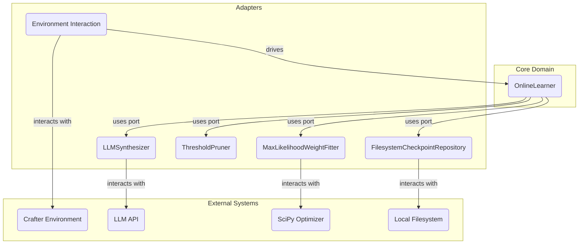
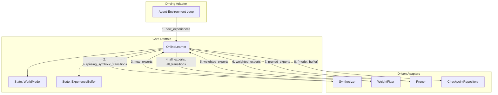

## Product Requirements Document: PoE-World for Crafter (Revised)

**Version:** 2.0
**Date:** 2025-08-18
**Author:** System

### 1. Overview
This document specifies the requirements for a modular, testable, and robust implementation of the PoE-World (Product of Experts World modeling) framework. The system is designed for **online learning**, meaning it will continuously refine its world model as it gathers new experience from an environment.

The initial target environment is **Crafter**, a 2D grid-world survival game with a rich, symbolic state space. The final output of this system will be a programmatic, probabilistic, symbolic world model that can be used by a planning agent to make decisions within the Crafter environment.

The implementation will adhere to a **Hexagonal (Ports and Adapters) Architecture** to ensure a clean separation between core domain logic and external dependencies like Large Language Models (LLMs), file systems, and specific machine learning libraries.

### 2. Goals and Objectives

*   **Implement a Functional Online Learning Pipeline**: The system must support a continuous loop of ingesting new experiences, synthesizing new expert source code, re-fitting expert weights, and pruning the model.
*   **Produce a Predictive Probabilistic World Model**: The core output must be a `WorldModel` object capable of predicting the next symbolic state (`MetadataT`) of the Crafter environment as a probability distribution.
*   **Ensure Robustness via Checkpointing**: The system must periodically save its complete state (learned model and all experience) and be able to automatically resume training from the last successful checkpoint.
*   **Adhere to Architectural Principles**: The implementation must strictly separate domain logic from external concerns through the use of protocols (ports).
*   **Ensure Testability**: Core components must be independently testable. The architecture must allow for mocking of expensive or complex dependencies (e.g., LLM calls).
*   **Extensibility**: The design should make it straightforward to replace components (e.g., use a different weight-fitting algorithm) or adapt the system to new symbolic environments.

### 3. System Architecture

The system will be built using a **Hexagonal (Ports and Adapters) Architecture**. This pattern isolates the core application logic from external services and tools.

*   **Core Domain (The `OnlineLearner`)**: At the center is the application's core logic, which orchestrates the learning process. It is completely decoupled from external technologies.
*   **Ports (The Protocols)**: The core domain defines a set of interfaces (`Protocol`s) for the services it needs. These ports define a contract for functionality like synthesis, weight fitting, and persistence.
*   **Adapters (Concrete Implementations)**: These are the concrete classes that implement the protocols and bridge the core logic to the outside world. For example, an `LLMSynthesizer` adapter implements the `SynthesizerProtocol` by making calls to an LLM client.



### 4. Core Domain Models and Interfaces

The core domain is defined by the following protocols and data structures. These serve as the formal contract between components.

```python
from typing import Protocol, TypeVar, Generic, Any, Optional
import attrs
import numpy as np
from scipy.special import logsumexp

# Provided Interfaces for Integration
from distant_sunburn.balrog_interfaces import Observation, Experience, MetadataT

# Core Data Structures
@attrs.define(frozen=True)
class SymbolicTransition(Generic[MetadataT]):
    """
    Represents a single transition at the symbolic level: (s_t, a_t, s_{t+1}).
    This is the fundamental unit of data for learning and evaluation.
    """
    prev_metadata: MetadataT
    action: str
    next_metadata: MetadataT

@attrs.define
class RandomValues:
    """
    Represents a discrete probability distribution over a set of integer values.
    This is the core mechanism for interpreting deterministic expert outputs
    as probabilistic predictions.
    
    Expert functions create "sharp" distributions by specifying only the values
    they believe are possible. These are then expanded via noise addition to
    cover all possible values in the domain, with the expert's preferred values
    having much higher log-probabilities than the rest.
    """
    values: np.ndarray
    logscores: np.ndarray = attrs.field()

    @logscores.default
    def _default_logscores(self) -> np.ndarray:
        """Defaults to uniform logscores if not provided."""
        return np.zeros_like(self.values, dtype=float)

    def sample(self) -> int:
        """Samples a value from the distribution."""
        probabilities = np.exp(self.logscores - logsumexp(self.logscores))
        return np.random.choice(self.values, p=probabilities)

    def evaluate_log_probability(self, value: int) -> float:
        """Calculates the log-probability of a given value."""
        log_probs = self.logscores - logsumexp(self.logscores)
        try:
            # Find the index of the value and return its log probability
            return log_probs[np.where(self.values == value)[0][0]]
        except IndexError:
            # The value was not a possible outcome under this distribution
            return -np.inf
    
    def add_noise_to_full_domain(self, all_possible_values: np.ndarray, noise_logScore: float = -10.0) -> 'RandomValues':
        """
        Expands this distribution to cover all possible values in the domain.
        Values not in the current distribution get the noise_logScore.
        This converts expert "opinions" into full probability distributions.
        """
        new_logscores = np.full_like(all_possible_values, noise_logScore, dtype=float)
        for i, val in enumerate(self.values):
            if val in all_possible_values:
                idx = np.where(all_possible_values == val)[0][0]
                new_logscores[idx] = self.logscores[i]
        return RandomValues(values=all_possible_values, logscores=new_logscores)

@attrs.define(frozen=True)
class ExpertSourceCode:
    """The source code representation of an expert function."""
    id: str
    source_code: str
    target_object_type: str  # e.g., "player", "zombie", "tree"

@attrs.define(frozen=True)
class WeightedExpert:
    """An expert associated with its learned weight."""
    expert: ExpertSourceCode
    weight: float

@attrs.define(frozen=True)
class ObjectTypeModel:
    """A collection of experts and weights for a specific object type."""
    object_type: str
    creation_experts: list[WeightedExpert]
    non_creation_experts: list[WeightedExpert]

# Core Component Protocols
class ExperienceBufferProtocol(Protocol[MetadataT]):
    """Manages the collection of experiences from the environment."""
    def add(self, experience: Experience[MetadataT]) -> None: ...
    def get_all_symbolic_transitions(self) -> list[SymbolicTransition[MetadataT]]: ...
    def __len__(self) -> int: ...

class WorldModelProtocol(Protocol[MetadataT]):
    """
    Represents the complete, learned symbolic world model. Operates purely on
    symbolic states (MetadataT), not raw observations.
    
    The model organizes experts by object type (e.g., player, zombie, tree) and
    separates creation experts (predicting new objects) from non-creation experts
    (predicting changes to existing objects).
    """
    def sample_next_state(self, current_state: MetadataT, action: str) -> MetadataT: ...
    def evaluate_log_probability(self, transition: SymbolicTransition[MetadataT]) -> float: ...
    def with_new_experts(self, new_experts: list[WeightedExpert]) -> 'WorldModelProtocol[MetadataT]': ...
    def get_object_type_model(self, object_type: str) -> ObjectTypeModel: ...
    @property
    def experts(self) -> list[WeightedExpert]: ...
    @property
    def object_types(self) -> list[str]: ...

class SynthesizerProtocol(Protocol[MetadataT]):
    """Generates new ExpertSourceCodes from observed data."""
    def synthesize(self, transitions: list[SymbolicTransition[MetadataT]]) -> list[ExpertSourceCode]: ...

class WeightFitterProtocol(Protocol[MetadataT]):
    """
    Fits weights to a set of experts based on a dataset of transitions.
    
    Weight fitting operates separately for each object type to prevent interference
    between experts for different object types. Within each object type, creation
    and non-creation experts are fitted separately.
    
    Supports both fast fitting (only new experts) and slow fitting (all experts)
    for online learning efficiency.
    """
    def fit(self, experts: list[ExpertSourceCode], transitions: list[SymbolicTransition[MetadataT]]) -> list[WeightedExpert]: ...
    def fit_object_type_experts(
        self, 
        object_type: str,
        experts: list[ExpertSourceCode], 
        transitions: list[SymbolicTransition[MetadataT]]
    ) -> ObjectTypeModel: ...
    def fast_fit(
        self, 
        new_experts: list[ExpertSourceCode], 
        existing_weighted_experts: list[WeightedExpert],
        transitions: list[SymbolicTransition[MetadataT]]
    ) -> list[WeightedExpert]: ...

class PrunerProtocol(Protocol):
    """Filters a list of weighted experts to remove those deemed not useful."""
    def prune(self, weighted_experts: list[WeightedExpert]) -> list[WeightedExpert]: ...

class CheckpointRepositoryProtocol(Protocol[MetadataT]):
    """Handles the persistence of the learning state."""
    def save(self, world_model: WorldModelProtocol[MetadataT], experience_buffer: ExperienceBufferProtocol[MetadataT]) -> None: ...
    def load(self) -> Optional[tuple[WorldModelProtocol[MetadataT], ExperienceBufferProtocol[MetadataT]]]: ...

# Expert Execution Protocols
class ExpertFunction(Protocol[MetadataT]):
    """Protocol defining the interface that all expert functions must implement."""
    
    def __call__(
        self, 
        current_state: MetadataT, 
        action: str, 
        **context: Any
    ) -> None:
        """
        Execute this expert's logic on the current state.
        
        Args:
            current_state: The symbolic state to modify (mutated in-place)
            action: The action being taken
            **context: Additional context (e.g., touch_side, touch_percent)
            
        Note:
            This function should modify current_state in-place by assigning
            RandomValues objects to attributes that the expert has an opinion about.
            Attributes not modified are assumed to have uniform distributions.
        """
        ...

class ExpertCompilerProtocol(Protocol[MetadataT]):
    """Protocol for compiling expert source code into executable functions."""
    
    def compile_source_code(self, expert: ExpertSourceCode) -> ExpertFunction[MetadataT]:
        """Compile an expert's source code into an executable function."""
        ...
    
    def validate_source_code(self, expert: ExpertSourceCode) -> bool:
        """Check if an expert's source code can be compiled successfully."""
        ...

class ExpertExecutorProtocol(Protocol[MetadataT]):
    """Protocol for executing compiled experts safely with error handling."""
    
    def execute_expert(
        self, 
        expert_func: ExpertFunction[MetadataT], 
        state: MetadataT, 
        action: str,
        **context: Any
    ) -> MetadataT:
        """Execute an expert function safely, returning the modified state."""
        ...

class ExpertCompilationError(Exception):
    """Raised when an expert's source code cannot be compiled or executed."""
    pass

```
---
Here is the next part of the document, detailing the component implementations and the learning pipeline.

### 5. Component Implementation Details (Adapters)

This section describes the initial concrete implementations for each protocol.

#### 5.1. `InMemoryExperienceBuffer` (implements `ExperienceBufferProtocol`)
*   **Responsibility**: Stores all `Experience` objects in an in-memory list and constructs symbolic transitions.
*   **Implementation Notes**:
    *   `add`: Appends a new `Experience` to an internal `list`.
    *   `get_all_symbolic_transitions`: Iterates through the internal list of experiences. For each step `t`, it constructs a `SymbolicTransition` by combining `prev_metadata` from experience `t-1` with the `action` and `next_metadata` from experience `t`. This operation should be memoized to avoid redundant computation.
    *   **Scalability Concern**: This implementation's memory usage grows linearly with the number of experiences. For long-running online learning, a fixed-size buffer (e.g., using `collections.deque`) should be considered to prevent unbounded memory growth.

#### 5.2. `PoEWorldModel` (implements `WorldModelProtocol`)
*   **Responsibility**: Represents the Product of Experts world model and implements the core probabilistic prediction logic.
*   **Dependencies**: An `ExpertCompilerProtocol` and an `ExpertExecutorProtocol`.
*   **Architecture**: The model organizes experts by object type (e.g., "player", "zombie", "tree") and separates creation experts from non-creation experts within each type. This prevents interference between different types of dynamics during weight fitting.

*   **5.2.1. Probabilistic Prediction Mechanism**
    The model predicts the next symbolic state attribute by attribute. The process for sampling a `next_state` is as follows:

    1.  **Generate Expert Outputs:** For a given `current_state` and `action`, the `PoEWorldModel` iterates through its list of weighted experts. For each expert:
        a.  A deep copy of the `current_state` is created.
        b.  The expert's `source_code` is compiled into an `ExpertFunction` via the `ExpertCompilerProtocol` (with caching for performance).
        c.  The compiled expert function is executed via the `ExpertExecutorProtocol`, which **mutates** the attributes of the copied state in-place.
        d.  **Crucially, the expert assigns `RandomValues` objects to attributes, not primitive values** (e.g., `state.player.inventory.wood = RandomValues(values=np.array([1]))`). This mutated state copy, containing probabilistic attribute values, is the expert's output distribution.

    2.  **Noise Addition and Unmodified Attributes:** After expert execution, the system performs two critical transformations:
        *   **Noise Addition**: Expert functions create "sharp" `RandomValues` containing only their preferred values. These are expanded using `add_noise_to_full_domain()` to cover all possible values, with non-preferred values receiving very low log-probabilities (e.g., -10.0).
        *   **Uniform Distributions**: For attributes an expert did *not* modify, the system assigns uniform `RandomValues` distributions over all possible values, signifying the expert has no opinion.
        *   **Discretization**: For continuous float values in the Crafter state (e.g., `hunger`), these must first be discretized into a fixed integer range (e.g., `0-1000`) before distributions can be created. The system must define these ranges and discretization rules.

    3.  **Combine Distributions (PoE Step):** The model constructs the final distribution for each attribute of the next state through matrix multiplication. For a single attribute (e.g., `player.inventory.wood`):
        a.  It gathers the `RandomValues` objects for this attribute from *all* experts (including the uniform distributions from experts that didn't modify it).
        b.  It creates a matrix where each row represents possible values and each column represents an expert's log-probabilities for those values.
        c.  The final combined log-scores are computed as: `combined_logscores = logscores_matrix.T @ expert_weights`, where the expert weights are the learned per-expert parameters.
        d.  This matrix multiplication implements the PoE formula in log-space, creating a final `RandomValues` object for the attribute.

    4.  **Instantiate Next State:** The final symbolic `next_state` is constructed by calling the `sample()` method on the final `RandomValues` object for every attribute, creating a new `MetadataT` instance.

*   **5.2.2. Implementation Notes**
    *   The model must be immutable. `with_new_experts` will return a new `PoEWorldModel` instance.
    *   **Expert Compilation Caching**: The model should cache compiled expert functions to avoid repeated compilation of the same source code. The cache key should be the expert's `id` and `source_code`.
    *   **Error Handling**: If an expert fails to compile or execute, it should be logged and excluded from that prediction. The system should continue with the remaining experts.
    *   `evaluate_log_probability` follows the same logic as sampling, but instead of calling `sample()` in the final step, it calls `evaluate_log_probability(observed_value)` for each attribute of the `transition.next_metadata` and sums the results.

#### 5.3. `LLMSynthesizer` (implements `SynthesizerProtocol`)
*   **Responsibility**: To generate candidate `ExpertSourceCode`s using an LLM.
*   **Internal Dependencies**: An `LlmClientProtocol` and a `PromptBuilderProtocol`.
*   **Implementation Notes**:
    *   The `synthesize` method will use an internal prompt builder to format the input `transitions` into a detailed prompt.
    *   The prompt must instruct the LLM to generate Python functions that implement the `ExpertFunction` protocol. These functions should:
        - Accept `(current_state: MetadataT, action: str, **context: Any)` parameters
        - Mutate the `current_state` object in-place
        - **Assign `RandomValues` objects to attributes**, not primitive types (e.g., `state.player.health = RandomValues(np.array([current_health - 1]))`)
        - Follow the naming convention established by PoE-World: `alter_{obj_type}_objects`
        - Specify their target object type and whether they handle creation or non-creation dynamics
    *   It will parse the LLM's response to extract valid Python code blocks, creating an `ExpertSourceCode` for each. It must be robust to malformed LLM outputs.
    *   **Validation**: Should use the `ExpertCompilerProtocol` to validate that synthesized experts compile successfully before returning them.

#### 5.4. `MaxLikelihoodWeightFitter` (implements `WeightFitterProtocol`)
*   **Responsibility**: To find the optimal weights for a set of experts by maximizing the log-likelihood of the data.
*   **Dependencies**: PyTorch for automatic differentiation and L-BFGS optimization.
*   **Weight Structure**: The parameters being optimized are **per-expert weights**, not per-object weights. Each expert has exactly one weight regardless of how many objects of that type exist in any given state. This weight represents how much to trust that expert's opinion across all objects of its target type.
*   **Implementation Notes**:
    *   **Object-Type Separation**: Weight fitting operates separately for each object type to prevent interference between experts for different object types (e.g., player experts vs zombie experts).
    *   **Loss Computation**: The objective function computes loss at the most granular level possible - per attribute, per object, per training example. For each object's each attribute, expert predictions are combined using matrix multiplication of log-probabilities weighted by expert weights.
    *   **Precomputation Strategy**: For efficiency, expert predictions are precomputed for all training examples before optimization begins, avoiding repeated execution of expert functions during weight updates.
    *   The `fit` method will define an objective function: the negative log-likelihood of a randomly sampled batch of transitions from the dataset (with a configurable batch size, defaulting to 10,000) given the experts and their weights, plus an L1 regularization term.
    *   It will use PyTorch's L-BFGS optimizer to find the weights that minimize this objective. L-BFGS is a quasi-Newton method that significantly outperforms gradient descent, Adam, and SGD for this type of optimization problem.
    *   **Batch Sampling**: For each optimization step, the fitter will randomly sample up to `batch_size` transitions from the full dataset. If the dataset has fewer transitions than the batch size, all transitions are used. This approach balances computational efficiency with statistical robustness.
    *   **Variable Object Counts**: The system naturally handles variable object counts because the same expert weights are applied to each object independently, and the loss simply accumulates more terms when there are more objects.
    *   **Weight Constraints and Initialization**: Expert weights are constrained to the range [0, 10] to prevent numerical instability. Weights are initialized to 0.5 (uniform contribution from all experts) unless continuing from previous weights.
    *   **Fast vs Slow Fitting Modes**: The fitter supports two modes:
        - **Fast fitting**: Only fits weights for newly added experts while preserving existing expert weights. Essential for online learning efficiency.
        - **Slow fitting**: Refits all expert weights from scratch for optimal model quality.
    *   **Scalability Concern**: While batch sampling helps with computational efficiency, fitting on the entire experience buffer at every update cycle may still be expensive for very large buffers. The implementation should consider strategies to mitigate this, such as using a fixed-size, sliding window of recent experiences, or exploring online optimization methods (e.g., SGD).

#### 5.5. `ThresholdPruner` (implements `PrunerProtocol`)
*   **Responsibility**: To filter out experts with low weights.
*   **Implementation Notes**: A pure function that returns a new list of `WeightedExpert`s where `weight` is greater than a configurable threshold (e.g., `0.01`).

#### 5.6. `FilesystemCheckpointRepository` (implements `CheckpointRepositoryProtocol`)
*   **Responsibility**: To save and load the learning state to the local filesystem.
*   **Dependencies**: A robust serialization library like `dill` or `cloudpickle`.
*   **Implementation Notes**:
    *   `save`: Serializes the `world_model` and `experience_buffer`. It should write to a temporary file first and then atomically rename it to prevent corruption.
    *   `load`: Deserializes the objects from the file. It must handle cases where the file does not exist (returning `None`) or is corrupted.

#### 5.7. `DefaultExpertCompiler` (implements `ExpertCompilerProtocol`)
*   **Responsibility**: To compile expert source code into executable `ExpertFunction` instances.
*   **Implementation Notes**:
    *   `compile_source_code`: Creates a controlled execution namespace with safe imports (`RandomValues`, `np`, etc.), executes the source code via `exec()`, and extracts the expert function by name.
    *   **Function Name Convention**: Expects expert functions to follow the naming pattern `alter_{obj_type}_objects` as established by the PoE-World synthesizers.
    *   **Signature Validation**: Uses the `inspect` module to validate that compiled functions match the `ExpertFunction` protocol signature.
    *   `validate_source_code`: Attempts compilation without caching to check if an expert's source code is valid. Returns `False` and logs errors for malformed experts.
    *   **Security**: The execution namespace should be restricted to prevent malicious code execution. Only essential imports should be available.

#### 5.8. `SafeExpertExecutor` (implements `ExpertExecutorProtocol`)
*   **Responsibility**: To execute compiled expert functions with proper error handling and resource management.
*   **Implementation Notes**:
    *   `execute_expert`: Creates a deep copy of the input state, calls the expert function with appropriate error handling, and returns the modified state.
    *   **Timeout Protection**: Should implement execution timeouts to prevent infinite loops in expert code.
    *   **Exception Handling**: Catches and logs exceptions from expert execution, returning the unmodified state on failure.
    *   **Resource Monitoring**: Could optionally monitor memory usage and terminate experts that consume excessive resources.

### 6. The Online Learning Pipeline (`OnlineLearner`)

The core application logic will be encapsulated in an `OnlineLearner` class, which orchestrates the components.

```python
class OnlineLearner(Generic[MetadataT]):
    def __init__(
        self,
        synthesizer: SynthesizerProtocol[MetadataT],
        fitter: WeightFitterProtocol[MetadataT],
        pruner: PrunerProtocol,
        repository: CheckpointRepositoryProtocol[MetadataT],
        expert_compiler: ExpertCompilerProtocol[MetadataT],
        expert_executor: ExpertExecutorProtocol[MetadataT],
        # ... other config ...
    ): # ...

    def update(self, new_experiences: list[Experience[MetadataT]]) -> None: # ...
```

**Workflow:**

1.  **Initialization**:
    *   The `OnlineLearner` is instantiated with concrete adapter implementations.
    *   It immediately calls `repository.load()` to attempt to resume from a checkpoint.
    *   If `load()` returns `None`, it initializes with a default `PoEWorldModel` (containing no experts) and an empty `InMemoryExperienceBuffer`.

2.  **Update Cycle (`update` method)**: This method is called by an external loop (the driving adapter) with new experiences from the environment.
    1.  **Ingest Data**: Add all `new_experiences` to the internal `experience_buffer`.
    2.  **Identify Gaps**: Get all symbolic transitions from the buffer. Use the current `world_model`'s `evaluate_log_probability` method to find a small batch of "surprising" transitions (those with the lowest log-probability).
    3.  **Synthesize**: Pass these surprising transitions to the `synthesizer`. If no new experts are returned, terminate the update cycle early.
    4.  **Combine Experts**: Create a combined list of the new experts and the existing experts from the current `world_model`.
    5.  **Fit Weights**: Pass the combined expert list and a representative batch of symbolic transitions from the buffer to the `fitter` to get a new list of `WeightedExpert`s. The fitter will automatically group experts by object type and fit creation vs. non-creation models separately. For online learning efficiency, use fast fitting (only new experts) for frequent updates and slow fitting (all experts) periodically for optimal model quality.
    6.  **Prune**: Pass the `WeightedExpert`s to the `pruner` to get the final, pruned set of experts.
    7.  **Update Model**: Create the new world model state by calling `self.world_model.with_new_experts(pruned_weighted_experts)`.
    8.  **Checkpoint**: Atomically save the new `world_model` and the current `experience_buffer` by calling `repository.save()`.

### 7. Dataflow and State Management
The `OnlineLearner` is the single source of truth for the system's state, which consists of the current `WorldModelProtocol` and `ExperienceBufferProtocol`. This state is updated atomically within the `update` method and persisted at the end of each successful cycle.


---
Finally, here is the conclusion of the revised PRD.

### 8. Testing Strategy

*   **Unit Tests**:
    *   Test each component adapter in isolation.
    *   Write specific tests for the `RandomValues` class to verify its sampling and log-probability calculations are correct.
    *   Test the internal logic of adapters, such as prompt formatting within the `LLMSynthesizer`.
    *   Test the `InMemoryExperienceBuffer`'s logic for correctly constructing `SymbolicTransition` objects from a sequence of `Experience` objects.

*   **Integration Tests**:
    *   **Weight Fitter + World Model**: Create a test with a simple, deterministic mock environment. Provide 2-3 hand-written experts (one correct, one incorrect). Verify that the `MaxLikelihoodWeightFitter` assigns a high weight to the correct expert and a low weight to the incorrect one.
    *   **Checkpointing and Resumption**: Write a test that initializes an `OnlineLearner`, runs one `update` cycle, and saves a checkpoint. Instantiate a new `OnlineLearner` and verify that it correctly loads the state from the checkpoint.
    *   **Full Online Loop (Mocked Synthesizer)**:
        1.  Create a simple mock `Synthesizer` that returns a correct, hand-coded expert when shown a specific "surprising" `SymbolicTransition`.
        2.  Instantiate the `OnlineLearner` with this mock synthesizer and other real components.
        3.  Run the `update` method with the triggering experience.
        4.  Assert that the learner's `world_model` now contains the correct expert with a high weight. This validates the entire orchestration logic without relying on an actual LLM.

### 9. Out of Scope for Initial Implementation

*   **Hierarchical Planner**: The learned `WorldModel` is the final output. Any agent that *uses* this model for planning is a separate component and outside the scope of this PRD.
*   **Advanced Synthesis Strategies**: The initial implementation will use a single, general-purpose `Synthesizer`. Specialized synthesizers for different types of dynamics can be added later.
*   **Hyperparameter Optimization**: The learning loop will use fixed, configured hyperparameters (e.g., batch size for synthesis, batch size for weight fitting, pruning threshold). An automated hyperparameter tuning system is not in scope.